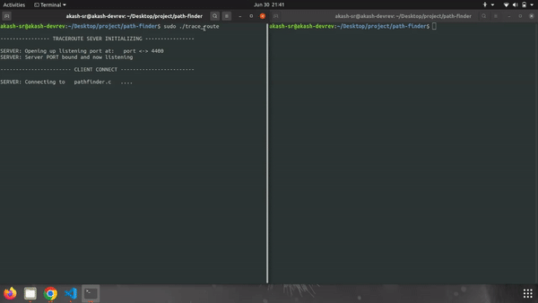

# Pathfinder

Traceroute is a very famous networking tools to determine the path from a machine to another machine. 

Traditionally, a traceroute would use the ICMP protocol which the routers understand. In every second, 3 ICMP packets are sent to the destination with increasing _TTL_ (time to live) starting from 1, then 2, then 3.. and so on.

_For TTL = 1_ : The most immediate router from the host to the destination is found.
_For TTL = 2_ : The second most immediate router from host to destination is found. 
_For TTL = 3_ : The third most immediate router from host to destination is found. 
.. and so on.

This goes on till the destination is reached. Hence, all the routers in the path have been identified.

In linux, the command to use traceroute for _google.com_  would be:   
``` traceroute google.com ```   


**Default traceroute vs Pathfinder**:  

CRITERIA | DEFAULT TRACEROUTE | Pathfinder 
-------|-------| ------------
SPEED | Takes ~ 30 seconds per URL | Takes < 5 seconds 
MULTIPLE COMMANDS | To be given one-by-one | Can take multiple in one go from a file
MULTIPROCESS | Total time = (no. of URLs) X 30 seconds | Total time < 5 seconds irrespective of no. of URLs 
CORRELATION | No functionality here | Finds the longest common path between the URLs specified 

----
### Table of Contents

- [How to run](#how-to-run)

- [Demo](#demo)

----

### How to run

- Clone the repository and enter ``` cd path-finder ```
- Compile the code using ``` make ```
- In ```domain.txt``` , enter the list of all the domains that you want to find longest common path of. 
- On one terminal, run the trace_route program using ``` sudo ./trace_route ``` .
- Open another terminal on the same directory and run the pathfinder program using ```sudo ./pathfinder```.

Voila! Expand the second terminal to see the results of individual traceroute and also the longest common path.

<p align = "center">
	
</p>


